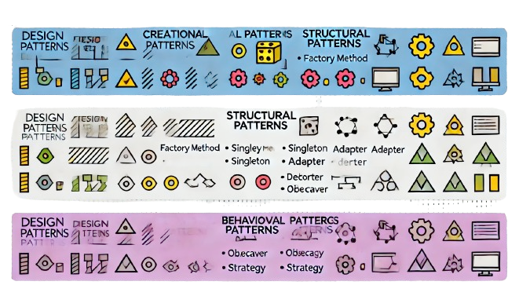

<h1>Patrones de Diseño:</h1>
<h2>¿Qué es un patrón de diseño y para qué existen?</h2>

Un patrón de diseño es una solución reutilizable para problemas comunes en el diseño de software. Son como plantillas que se pueden aplicar a situaciones particulares para resolver problemas de diseño y arquitectura de manera eficiente. Los patrones de diseño existen para ayudar a los desarrolladores a crear software más robusto, flexible y mantenible.

<h2>¿Por qué es importante conocerlos?</h2>
<ul>
<li><strong>Reutilización de soluciones:</strong> Permiten aplicar soluciones probadas y optimizadas para problemas recurrentes.</li>
<li><strong>Comunicación:</strong> Facilitan la comunicación entre desarrolladores al proporcionar un lenguaje común para describir problemas y soluciones.</li>
<li><strong>Mantenibilidad:</strong> Mejoran la mantenibilidad del código al estructurar el diseño de manera coherente y comprensible.</li>
<li><strong>Flexibilidad:</strong> Ayudan a crear software más flexible y adaptable a cambios futuros.</li>
<li><strong>Calidad:</strong> Promueven la escritura de código de alta calidad que sigue buenas prácticas de diseño.</li>
</ul>

<h2>Tipos de Patrones de Diseño:</h2>

Los patrones de diseño se dividen principalmente en tres categorías:

<h3>Patrones Creacionales:</h3>

Se enfocan en los mecanismos de creación de objetos, tratando de crear objetos de manera adecuada para la situación dada. Los más comunes son:

<ul>
<li>Abstract Factory</li>
<li>Builder</li>
<li>Factory Method</li>
<li>Prototype</li>
<li>Singleton</li>
</ul>

<h3>Patrones Estructurales:</h3>

Se ocupan de la composición de clases y objetos para formar estructuras más grandes. Los más comunes son:

<ul>
<li>Adapter</li>
<li>Bridge</li>
<li>Composite</li>
<li>Decorator</li>
<li>Facade</li>
<li>Flyweight</li>
<li>Proxy</li>
</ul>

<h3>Patrones Comportamentales:</h3>

Se centran en la comunicación entre objetos, específicamente en cómo interactúan y cómo se distribuyen las responsabilidades entre ellos. Los más comunes son:

<ul>
<li>Chain of Responsibility</li>
<li>Command</li>
<li>Interpreter</li>
<li>Iterator</li>
<li>Mediator</li>
<li>Memento</li>
<li>Observer</li>
<li>State</li>
<li>Strategy</li>
<li>Template Method</li>
<li>Visitor</li>
</ul>

<h2>Ejemplos de Problemas y Qué Patrón Deberíamos Usar:</h2>

<h3>Problema: Necesitas crear diferentes tipos de productos relacionados sin especificar sus clases concretas.</h3>

<strong>Solución:</strong> Utilizar el patrón <em>Abstract Factory</em>.

<h3>Problema: Quieres evitar constructores telescópicos al construir objetos complejos.</h3>

<strong>Solución:</strong> Utilizar el patrón <em>Builder</em>.

<h3>Problema: Necesitas asegurar que una clase solo tenga una única instancia.</h3>

<strong>Solución:</strong> Utilizar el patrón <em>Singleton</em>.

<h3>Problema: Necesitas trabajar con una interfaz incompatible con la que tienes.</h3>

<strong>Solución:</strong> Utilizar el patrón <em>Adapter</em>.

<h3>Problema: Quieres permitir que un objeto altere su comportamiento cuando cambie su estado interno.</h3>

<strong>Solución:</strong> Utilizar el patrón <em>State</em>.

<h3>Problema: Necesitas notificar a varios objetos sobre cambios en el estado de otro objeto.</h3>

<strong>Solución:</strong> Utilizar el patrón <em>Observer</em>.

<h2>Cuándo Usar Patrones y Cuándo No:</h2>

<h3>Cuándo Usar Patrones:</h3>
<ul>
<li>Cuando te enfrentas a problemas de diseño recurrentes y necesitas soluciones probadas.</li>
<li>Cuando deseas mejorar la comunicación entre desarrolladores utilizando un lenguaje común de diseño.</li>
<li>Cuando buscas mejorar la flexibilidad y la mantenibilidad de tu código.</li>
<li>Cuando necesitas estructurar el código para soportar futuras expansiones o cambios.</li>
</ul>

<h3>Cuándo No Usar Patrones:</h3>
<ul>
<li>Cuando el problema es simple y no justifica la complejidad adicional que un patrón podría introducir.</li>
<li>Cuando no estás familiarizado con los patrones y su implementación podría llevar a un uso incorrecto.</li>
<li>Cuando la implementación de un patrón podría complicar innecesariamente el código.</li>
<li>Cuando la solución más simple es suficiente y cumple con los requisitos.</li>
</ul>

